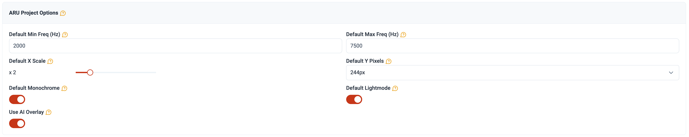
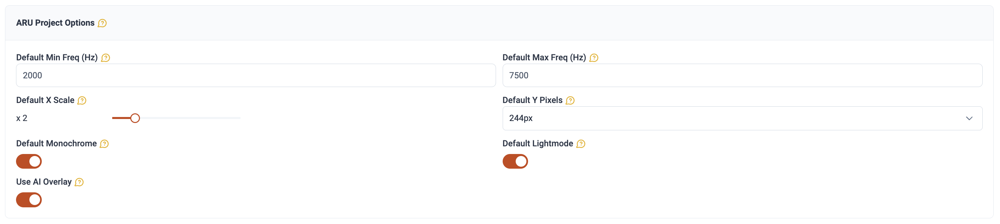

{style="float:left`;" fig-alt="Photo of the ocean" fig-align="center"}

```{r Download packages and load data}
#| include: false
#| echo: false
#| eval: true
#| warning: false
#| message: false

library(tidyverse)
library(leaflet)
library(wildrtrax)
library(unmarked)
library(sf)
library(terra)
library(vctrs)
library(ggridges)
library(scales)
library(kableExtra)
library(plotly)
library(DT)
library(lme4)
library(ggpubr)
library(vegan)
library(MuMIn)
library(AICcmodavg)
library(mapview)
library(broom)

wt_auth()

load('pei.RData')
save.image('pei.RData')
#cirrus_penp_recs  <- readRDS('penpcirrus.RDS')
```

# Abstract

Passive acoustic monitoring has proven to be a valuable tool for monitoring vocalizing species. Environmental sensors are becoming increasingly easy to program and can autonomously generating extensive data sets of the soundscape, an invaluable resource for ecological integrity monitoring. Prince Edward Island National deployed autonomous recording units (ARUs) across `r pei_locs |> st_drop_geometry() |> select(location) |> distinct() |> tally()` locations during a comprehensive `r pei_main |> pull(recording_date_time) |> year() |> n_distinct()`-year survey. ARUs detected a total of `r nrow(distinct_spp)` species including birds, amphibians and mammals. The analysis revealed that songbird species richness and diversity remained relatively stable, while single-species occupancy at individual sites exhibited diverse patterns. Common and generalist species showed consistent occupancy despite large sources of natural and anthropogenic disturbance. Ongoing monitoring and dynamic models can yield more detailed and predictive results to ensure the continued maintenance of ecological integrity in the Park.

::: {.callout-note collapse="true" style="background-color: #f4f4f4; padding: 20px;"}
This report is dynamically generated, meaning its results may evolve with the addition of new data or further analyses. For the most recent updates, refer to the publication date and feel free to reach out to the authors.
:::

```{r Data download}
#| warning: false
#| message: false
#| echo: true
#| eval: false
#| include: false

pei_projects <- wildrtrax::wt_get_projects(sensor = 'ARU') |>
  filter(grepl('Prince Edward Island National Park', project)) |>
  select(project_id) |>
  pull()

pei_main <-
  map_dfr(
    .x = pei_projects,
    .f = ~ wildrtrax::wt_download_report(
      project_id = .x,
      sensor_id = "ARU",
      reports = "main"
    ))

pei_hawkears <-
  map_dfr(
    .x = pei_projects,
    .f = ~ wildrtrax::wt_download_report(
      project_id = .x,
      sensor_id = "ARU",
      reports = "ai"
    ))

balance <- pei_main |>
  mutate(year = year(recording_date_time)) |>
  group_by(location, year) |>
  distinct(task_id) |>
  slice_sample(n = 4) |>
  ungroup() |>
  distinct() |>
  pull(task_id)

pei_main <- pei_main |>
  filter(task_id %in% balance)
  
```

------------------------------------------------------------------------

# Land Acknowledgement

In the spirit of Reconciliation, wen acknowledge that the land upon which this data was gathered is unceeded Mi'kmaq territory. Epekwitk (Prince Edward Island), Mi'kma'ki, is covered by the historic Treaties of Peace and Friendship. We pay our respects to the Indigenous Mi'kmaq People who have occupied this Island for over 12,000 years; past, present and future.

# Introduction

Human activities have been identified as key pressures and contributors to the global decline in forest wildlife (@allan2017recent). The repercussions of habitat fragmentation (@fahrig2003effects) and loss (@hanski2011habitat), climate change (@mantyka2012interactions, @sattar2021review, @abrahms2023climate), and increased access to sensitive areas exert direct and indirect pressures on forest biodiversity, particularly in managed regions in Canada (@lemieux2011state).

In 2019, Prince Edward Island National Park initiated a program incorporating autonomous recording units (ARUs) for passive acoustic monitoring (PAM) of the Park's wildlife. ARUs are compact environmental sensors that are designed to passively record the environment (@aru-overview), capturing vocalizing species like birds and amphibians, which is growing in use across the globe (@lots-of-pam). This technology enables resource managers to conduct prolonged surveys with minimal human interference. The subsequent data collected by these units contribute valuable information to ecological integrity metrics such as species richness, diversity, occupancy, and trends over time. This data aids decision-making and management within the Park. Given the rapid and ease of accumulating data from these units, maintaining a high standard of data integrity is paramount to ensure future data interoperability and sharing. [WildTrax](https://www.wildtrax.ca) is an online platform developed by the [Alberta Biodiversity Monitoring Institute (**ABMI**)](https://abmi.ca) for users of environmental sensors to help addresses these big data challenges by providing solutions to standardize, harmonize, and share data.

The objectives of this report are to:

-   Describe the data management and processing procedures for the acoustic data collected from 2019 to 2025;
-   Utilize traditional human tagging, visual scanning and automated recognition techniques to detect and count species and individuals heard on recordings;
-   Define straightforward methods for evaluating species presence, species richness, and species occupancy over time at various locations;
-   Offer recommendations for ongoing monitoring approaches to contribute to the assessment of ecological integrity in forest ecosystems;
-   Facilitate data publication to the public, resource managers, academic institutions, and any other relevant agencies

------------------------------------------------------------------------

# Methods

## Data collection

Data were collected during the spring and summer seasons from `r min(years)` to `r max(years)`. A total of `r pei_locs |> st_drop_geometry() |> select(location) |> distinct() |> tally()` locations were surveyed over the seven-year period:

-   29 locations as part of the forest songbird monitoring program (code: `PENP-*`) with ARUs recording during the morning hours,
-   6 for Bank Swallow Monitoring (code: `PENP-BS-*` and `BANS-*`) with ARUs placed strategically beside ponds recording in the evening,
-   2 locations deployed in First Nations communities (`ASC-1, LXI-1`) to complement the forest songbird and evening schedules,
-   And one location (`PENP-E1`), which was to examine the effects of a single public event

Locations were surveyed on rotation with `r length(repeats)` locations (`r repeats`) surveyed each year. A detailed list of all survey years can be found in Table 1 (@tbl-loc-summary) and illustrated in Figure 1 (@fig-aru-monitoring-locations). ARUs were deployed at the beginning of the breeding season in April-May, and rotated locations until their final retrieval in July-August. At the forest songbird locations (`PENP-*`), the ARUs were set to record for 30 minutes continuously every hour for four hours, starting one hour before dawn and ending three hours after dawn. For Bank Swallow Monitoring locations (`PENP-BS`,`BANS-`), recordings were made every 5 minutes for a duration of 3 minutes each from 1.5 hours before dusk to 1.5 hours after dusk. On average, each ARU recorded for

```{r}
#| warning: false
#| echo: false
#| eval: false
#| message: false
#| include: true
#| results: hide

pei_locs <- pei_main |>
  select(location, latitude, longitude) |>
  distinct() |>
  drop_na(latitude) |>
  sf::st_as_sf(coords = c("longitude","latitude"), crs = 4326)

repeats <- pei_locs |>
  st_drop_geometry() |>
  inner_join(pei_main |> mutate(year = year(recording_date_time)) |> select(location, year) |> distinct(), by = "location") |>
  group_by(location) |>
  summarise(count = n_distinct(year)) |>
  ungroup() |>
  filter(count == 6) |>
  select(location) |>
  distinct() |>
  pull()

# Define geospatial assets for covariates
pei_shp <- read_sf('assets/PEI.shp')
peinp_shp <- read_sf('assets/peinp.shp')
peinp_shp <- st_transform(peinp_shp, st_crs(pei_locs)) |> st_make_valid()
natlpark_shp <- read_sf('assets/National_Parks_and_National_Park_Reserves_of_Canada_Legislative_Boundaries.shp')

# Coast metrics
coast <- read_sf('assets/coastal_waters/lhy_000h16a_e.shp')
coast <- st_transform(coast, st_crs(pei_locs)) |> st_make_valid()
nearest_idx <- st_nearest_feature(pei_locs, coast)
coast_nearest <- coast |> slice(nearest_idx)
pei_locs <- pei_locs |> mutate(coast_distance = as.numeric(st_distance(geometry, coast_nearest$geometry, by_element = TRUE)))

# Landcover variables
clu <- read_sf('assets/CLUI_2020/Corporate_Land_Use_Inventory_(CLUI)_2020.shp')
clu <- st_transform(clu, st_crs(pei_locs)) |> st_make_valid()
clu_crop <- st_crop(clu, xmin=-63.8658, ymin=46.19434, xmax=-62.65111, ymax=46.6279)
cover_cols = c("COVER1","COVER2","COVER3","COVER4","COVER5")
wetland_cols = c("CLASS1","CLASS2","CLASS3","CLASS4","CLASS5","CLASS6","CLASS7")

locs_buff <- st_buffer(pei_locs, 150) |> 
  select(location) |> 
  distinct() %>%
  mutate(buff_area = as.numeric(st_area(.)))
ints <- st_intersection(clu_crop, locs_buff)
ints2 <- ints %>% mutate(area = as.numeric(st_area(.)))

df_long <- ints2 %>%
  filter(!grepl('ASC|LXI',location)) %>%
  select(location, COVER1, CLASS1, area) %>%
  distinct() %>%
  mutate(COVER1 = case_when(
    !is.na(CLASS1) & CLASS1 != "NA" ~ CLASS1,  # use wetland class if present
    TRUE ~ COVER1
  )) %>%
  st_drop_geometry() %>%
  group_by(location, COVER1) %>%
  summarise(area = sum(area)) %>%
  ungroup() %>%
  pivot_wider(names_from = COVER1, values_from = area) %>%
  mutate_all(~replace(., is.na(.), 0)) %>%
  mutate(across(-location, ~as.numeric(.x))) %>%
  rowwise() %>%
  mutate(total = sum(c_across(-location))) %>%
  ungroup() %>%
  mutate(across(-c(location, total), ~ .x / total)) %>%
  mutate(missed = round((total / 70685.8), 2))

lk_lc <- tibble(
  land_cover = c("DMW", "SDW", "WB", "WS", "GRS", "HAY", "RM", "SM", "SOY",
                 "TRE", "MDW", "PAV", "SAW", "OTH", "AL", "SSW", "DT", 
                 "PO", "CC", "OWW", "BF", "BOW", "WSW", "BS", "BAR", "PAS", "SHR"),
  description = c("Deep Marsh", "Sand Dune", "White Birch", "White Spruce", 
                  "Grass", "Hay", "Red Maple", "Sugar Maple", "Soy",
                  "Trees", "Meadow", "Paved", "Salt Marsh", "Other", "Alder", 
                  "Shrub Swamp", NA, 
                  "Poplar", "Clear Cut", "Open Water", "Balsam Fir", "Bog", 
                  "Wooded Swamp", "Black Spruce", "Bare Soil", "Pasture", "Shrubs")
)

df_lk <- df_long %>%
  pivot_longer(-location, names_to = "landcover", values_to = "landcover_proportion") %>%
  filter(!landcover_proportion == 0) %>%
  inner_join(., lk_lc, by = c("landcover" = "land_cover")) 

covs <- df_lk |>
  inner_join(
    pei_locs |> 
      st_drop_geometry() |> 
      select(location, coast_distance) |>
      distinct(),                          # add this
    by = "location"
  ) |>
  mutate(landcover = case_when(landcover %in% c("WS","BS","BF") ~ "Conifer",
                               landcover %in% c("RM","WB","AL","PO") ~ "Deciduous",
                               landcover %in% c("SOY","PAV","TRE","HAY","CC","SM","PAS","SHR","OTH") ~ "Anthro",
                               landcover %in% c("BAR","GRS") ~ "Open",
                               landcover %in% c("DMW", "SDW", "MDW", "SAW", "SSW", "OWW", "BOW", "WSW") ~ "Wetlands",
                               landcover %in% c("NA") ~ NA_character_,
                               TRUE ~ NA_character_)) |>
  group_by(location, coast_distance, landcover) |>
  summarise(landcover_proportion = sum((landcover_proportion))) |>
  ungroup()

locs_summary <- pei_locs |>
  group_by(location) |>
  slice_min(coast_distance, n = 1, with_ties = FALSE) |>
  ungroup() |>
  mutate(coast_distance = round(coast_distance, 0)) |>
  st_drop_geometry() |>
  inner_join(pei_main |> mutate(year = year(recording_date_time)) |> select(location, year) |> distinct()) |>
  group_by(location, year) |>
  mutate(value = row_number()) |>
  ungroup() |>
  arrange(year) |>
  pivot_wider(names_from = year, values_from = value, values_fill = 0) |>
  mutate(Site = case_when(grepl('PENP-1-*',location) ~ "Cavendish",
                          grepl('PENP-2-*',location) ~ "Brackley",
                          grepl('PENP-3-*',location) ~ "Dalvay",
                          grepl('PENP-4-*',location) ~ "Greenwich",
                          grepl('PENP-5-*',location) ~ "Skmaqn",
                          grepl('PENP-6-*',location) ~ "North Rustico",
                          grepl('PENP-BS-*|*BANS*',location) ~ "Bank Swallow Monitoring",
                          grepl('PENP-E1-*',location) ~ "Skmaqn",
                          TRUE ~ "First Nations Communities")) %>%
  rename('Location' = location)

```

```{r}
#| echo: false
#| eval: true
#| warning: false
#| message: false
#| include: true
#| fig-align: center
#| fig-cap: Locations from Prince Edward Island National Park ARU Monitoring Program
#| label: fig-aru-monitoring-locations

pei_locs2 <- pei_locs |> 
  left_join(locs_summary |> select(Location, Site) |> distinct(), 
            by = c("location" = "Location"))

pal <- colorFactor(palette = "Set3", domain = pei_locs2$Site)

m <- leaflet() %>%
  addTiles() %>%
  addPolygons(
    data = peinp_shp,
    fillColor = "#29ABE2",
    color = "black",
    weight = 1,
    fillOpacity = 0.4,
    popup = ~paste("Park:", NAME_E)
  ) %>%
  addCircleMarkers(
    data = pei_locs2,
    popup = ~paste("Location:", location, "<br>Site:", Site),
    fillColor = ~pal(Site),
    color = "black",
    fillOpacity = 0.8,
    radius = 6,
    weight = 3
  ) %>%
  addLegend(
    pal = pal,
    values = pei_locs2$Site,
    title = "Site"
  ) %>%
  addMeasure() %>%
  addMiniMap(position = "bottomleft")

if (knitr::is_html_output()) {
  m
} else {
  map_file <- "map_aru_locations.png"
  if (!file.exists(map_file)) mapview::mapshot2(m, file = map_file)
  knitr::include_graphics(map_file)
}
```

```{r}
#| warning: false
#| echo: false
#| eval: true
#| message: false
#| include: true
#| label: tbl-loc-summary
#| tbl-cap: Locations surveyed across years. Ones indicated a deployment in that year for that location

n_years <- pei_main |> mutate(year = year(recording_date_time)) |> distinct(year) |> nrow()

kable(locs_summary %>%
        select(-coast_distance) |>
  mutate(
    years_surveyed = rowSums(across(c(`2019`, `2020`, `2021`, `2022`, `2023`, `2024`, `2025`))),
    survey_coverage = case_when(
      years_surveyed == n_years ~ "Full Survey",
      years_surveyed >= 4       ~ "Majority of Years",
      years_surveyed >= 2       ~ "Some Years",
      years_surveyed == 1       ~ "Single Year",
      TRUE                      ~ "Not Surveyed"
    )
  ))
```

```{r}
#| warning: false
#| echo: false
#| eval: true
#| message: false
#| include: true
#| label: tbl-obvs-and-covs
#| tbl-cap: Site covariates for each forest songbird monitoring (PENP-*) location. Landcover is measured as proportion cover at 150 meter radius surrounding the ARU categorized into anthropogenic (pavement, soy), open (grass, sand dune, bare soil), deciduous (red maple, white birch, alder, poplar) and conifer (white spruce, black spruce, balsam fir) and wetlands.

covs_all <- covs %>%
  mutate_at(vars(landcover_proportion, coast_distance), ~round(., 2)) |>
  pivot_wider(names_from = landcover, values_from = landcover_proportion, values_fill = 0) |>
  rename("Distance from coast (m)" = coast_distance)

kable(covs_all)

```

## Data management

A total of 12456 recordings were collected (see @fig-recs-collect). From 2019 - 2021, data were transferred via hard drive to the University of Alberta in Edmonton, where they are redundantly stored on a server known as Cirrus. The recordings were standardized to ensure adherence to the naming convention of `LOCATION_DATETIME`, such as `PENP-1-1_20230625_053500.wav`. The remaining recordings (2022 - 2025) were directly uploaded to WildTrax by Parks Canada staff and can be downloaded from the platform's Recording tab, accessible under Manage \> Download list of recordings.

```{r}
#| warning: false
#| echo: false
#| eval: false
#| message: false
#| include: true
#| results: hide

 wildtrax_penp_recs <- wt_get_sync("organization_recordings", organization = 5463) %>%
   select(location, recording_date_time, recording_duration) %>%
   mutate(recording_date_time = as.POSIXct(recording_date_time, format="%Y-%m-%d %H:%M"))

 all_recs <- cirrus_penp_recs %>%
   select(location, recording_date_time, length_seconds) %>%
   rename(recording_duration = length_seconds) |>
   bind_rows(wildtrax_penp_recs) %>%
   select(location, recording_date_time, recording_duration) %>%
   distinct() %>%
   drop_na() %>%
   mutate(julian = yday(recording_date_time),
          hour = hour(recording_date_time),
          year = year(recording_date_time),
          month= month(recording_date_time, label = T))

 count_recs <- nrow(all_recs)

 average_deployment <- all_recs |>
   group_by(location, year) |>
   summarise(count = n_distinct(julian)) |>
   ungroup() |>
   summarise(mean = round(mean(count),2),
             sd = round(sd(count),2))
  
```

```{r}
#| warning: false
#| echo: false
#| eval: true
#| message: false
#| include: true
#| results: hide
#| fig-align: center
#| fig-height: 8
#| fig-cap: Ridgeplot of recordings collected for each location over each survey year
#| label: fig-recs-collect
#| cap-location: margin

all_recs |>
  filter(!grepl('KRUM',location)) |>
  count(year, location) |>
  ggplot(aes(x = year, y = location, fill = n)) +
  geom_tile() +
  scale_fill_viridis_c(name = "Recordings") +
  labs(x = "Year", y = "Location") +
  theme_minimal() +
  theme(axis.text.x = element_text(angle = 45, hjust = 1))

```

## Community data processing

The principal goal for data processing was to describe the acoustic community of species heard at locations while choosing a large enough subset of recordings for analyses. To ensure balanced replication, for each location and year surveyed, four randomly selected recordings were processed for 3-minutes between the hours of 4:00 AM - 7:59 AM ideally on four separate dates (see @tbl-loc-repl). Four recordings will ensure that we have the minimum number of samples for a simple occupancy analysis (@mackenzie2002estimating and @imperfect-occu). Tags are made using count-removal (see @farnsworth2002removal, @time-removal) where tags are only made at the time of first detection of each individual heard on the recordings. In case a species was overly abundant a TMTT ('too many to tag') flag was used (see @tbl-tmtt). `r round(nrow(tmtt_tags)/nrow(pei_main),2)*100`% of the total tags were TMTT but were subsequently converted to numeric using `wildrtrax::wt_replace_tmtt`. We also verified that all tags that were created were checked by a second observer (n = `r verified_tags |> select(Proportion) |> slice(3) |> pull()`) to ensure accuracy of detections (see @tbl-verified). Amphibian abundance was estimated at the time of first detection using the [North American Amphibian Monitoring Program](https://www.usgs.gov/centers/eesc/science/north-american-amphibian-monitoring-program) with abundance of species being estimated on the scale of "calling intensity index" (CI) of 1 - 3. Mammals such as Red Squirrel, were also noted on the recordings. After the data are processed in WildTrax, the [wildrtrax](https://abbiodiversity.github.io/wildrtrax/) package is use to download the data into a standard format prepared for analysis. The `wt_download_report` function downloads the data directly to a R framework for easy manipulation (see [wildrtrax APIs](https://abbiodiversity.github.io/wildrtrax/articles/apis.html)).

```{r}
#| warning: false
#| message: false
#| echo: false
#| eval: true
#| include: false

pei_main |> names()

```

```{r}
#| warning: false
#| echo: false
#| eval: false
#| include: true

task_info <- suppressMessages(map_dfr(pei_projects, ~wt_get_sync("project_aru_tasks", .x)))

```

```{r}
#| warning: false
#| echo: false
#| eval: true
#| message: false
#| include: true
#| label: tbl-loc-repl
#| tbl-cap: Example of tasks and unit replication

kable(head(task_info))

```

```{r}
#| warning: false
#| echo: false
#| message: false
#| eval: true
#| include: true
#| label: tbl-verified
#| tbl-cap: Proportion of tags verified

all_tags <- pei_main |> 
  tally() |>
  pull()

verified_tags <- pei_main |>
  group_by(tag_is_verified) |>
  tally() |>
  mutate(Proportion = round(n / all_tags,4)*100) |>
  rename("Count" = n) |>
  rename("Tag is verified" = tag_is_verified)

kable(head(verified_tags))
```

```{r}
#| warning: false
#| echo: false
#| message: false
#| eval: true
#| include: true
#| label: tbl-tmtt
#| tbl-cap: TMTT tags

tmtt_tags <- pei_main |>
  select(location, recording_date_time, species_code, abundance) |>
  distinct() |>
  filter(abundance == "TMTT")

kable(head(tmtt_tags))

```

```{r}
#| warning: false
#| echo: false
#| eval: true
#| message: false
#| include: true
#| label: tbl-bird-guilds
#| tbl-cap: Common bird forest species guilds. For nesting habitat; Ag = Agricultural, Be = Beach, Bo = Bog, CW = Coniferous Woodlands, ES = Early Successional, MW = Mixed Woodlands, OW = Open Woodlands, TSS = Treed/Shrubby Swamp, Ur = Urban. Species from CW, MW, OW, TSS were used for analysis.

guilds <- read_csv("assets/bird_guilds.csv") |>
  select(species_common_name, habitat_nesting) |>
  filter(habitat_nesting %in% c("CW","MW","OW","TSS")) |>
  mutate(habitat_nesting = case_when(habitat_nesting == "CW" ~ "Coniferous woodland",
                                     habitat_nesting == "MW" ~ "Mixed Woodlands",
                                     habitat_nesting == "OW" ~ "Open Woodlands",
                                     habitat_nesting == "TSS" ~ "Treed/Shrubby Swamp",
                                     habitat_nesting == "Ur" ~ "Urban",
                                     TRUE ~ habitat_nesting))

kable(guilds)

```

## Visual scanning

Visual scanning is the concept of visually examining spectrograms in order to find a signal within an audio recording. Visual scanning can be a useful processing method allowing trained users to process recordings much faster than traditional listening. It has been used for detecting different taxa (amphibians: @vis-scan-amphs, mammals: @aru-vs-cams-wolves) with comparable biological metrics, as well as helping to maximize species detection in large acoustic monitoring data sets (@all-the-scans). WildTrax's project settings and dynamic spectrogram settings in the processing interface allow users to upload many recordings, while also allowing frequency-limited or time-limited spectrograms. These changes are easily made by adjusting project settings in WildTrax (see @fig-project-dynamic). Bank Swallow (*Riparia riparia*) are federally listed as threatened in Canada (see [Government of Canada](https://wildlife-species.canada.ca/bird-status/oiseau-bird-eng.aspx?sY=2019&sL=e&sM=p1&sB=BANS)) and provincially. They produce distinctive, broadband vocalizations that are readily identifiable on a spectrogram, making them well-suited to visual scanning workflows. We used visual scanning techniques to examine the presence of Bank Swallow at targeted sites across PEINP. ARUs were placed near ponds where Bank Swallow are known to forage, as foraging habitat quality and availability may play an important role in supporting local breeding populations. Documenting pond use by Bank Swallow can therefore inform habitat management and conservation planning within the park. In 2025, we refined our processing approach using dynamic spectrogram settings (see @fig-project-dynamic-2025), constraining the frequency range to the 95% CI of Bank Swallow vocalizations while expanding the time window, reducing visual noise and expediting detection. To complement visual scanning and further reduce false negatives, we evaluated two automated classifiers, BirdNET v2.0 (@kahl2021birdnet) and HawkEars v1.0.8 (@huus2025hawkears), with classifier outputs overlaid directly on spectrograms in WildTrax, allowing reviewers to cross-reference detections and apply expert judgment where classifier confidence was low.

{#fig-project-dynamic}

{#fig-project-dynamic-2025}

```{r}
#| warning: false
#| message: false
#| echo: false
#| eval: false
#| include: false

bans_projects <- wt_get_projects('ARU') |> filter(grepl('National Park Bank Swallow', project)) |> pull(project_id)

# Download and bind all the data
bans_aru <- imap_dfr(
  bans_projects,
  ~ map_dfr(
      .x, 
      ~ wt_download_report(
          project_id = .x,
          sensor_id = "ARU",
          reports = "main"
        )
    ) |> mutate(data_type = .y, .after = organization) 
)

# Get all HawkEars detections
bans_hawkears <- imap_dfr(
  bans_projects,
  ~ map_dfr(
      .x, 
      ~ wt_download_report(
          project_id = .x,
          sensor_id = "ARU",
          reports = c("ai")
        )
    ) |> mutate(data_type = .y, .after = organization) 
)

bans_aru |>
  mutate(year = year(recording_date_time)) |>
  filter(year == 2025, task_is_complete == T) |>
  summarise(sum = sum(task_duration) / 3600)

jbm <- bans_aru |>
  mutate(individual_count = as.character(abundance)) |>
  bind_rows(pei_main) |>
  filter(species_code == "BANS") |>
  select(location, recording_date_time, species_code, individual_order, individual_count) |>
  distinct()

```

## Automated recognition

Automated recognition is a well-known process to help detect rare and elusive species (@knight2019classification. @shonfield2018utility) as well as species that may have a low detectability by collecting large data sets. In order to determine the presence of a few key species-at-risk, we utilized automated recognizers and deployed them across all the recordings in the 2019 data set. We constructed a recognizer for Eastern Wood-Pewee (EAWP) and used three previously constructed Wildlife Acoustics SongScope recognizers for Olive-sided Flycatcher (OSFL), Rusty Blackbird (RUBL) and Canada Warbler (CAWA) to detect for the presence of these species in the 2019 data set. All recognizers are freely available on WildTrax under Methods and Protocols \> [Automated Recognizers](https://wildtrax.ca/resources/methods-protocols/automated-recognizers/). Hits were verified and true positives for presence at each location (recording where the species was first positively detected) were uploaded to WildTrax via the `wt_songscope_tags` function in `wildrtrax`.

## Analyses

Species richness, diversity and occupancy were calculated using the r nrow(locs_summary) - 9 forest songbird monitoring locations (`PENP-`). We calculated species richness as distinct species found at each location and year surveyed (see @fig-spp-rich-locs), omitting species using `wildrtrax::wt_tidy_species()` for abiotic, amphibians, unknowns and insects. To determine if there were any changes to species diversity, we used Shannon's diversity index (@shannon1948mathematical) over years using `vegan::diversity(index="shannon")` (see @fig-shannon).

For testing species occupancy, we selected locations with a minimum of four dawn visits for each year across all five years, focusing on forest obligate species for ecological relevance (see @tbl-bird-guilds). Utilizing a single-season single-species occupancy model from @mackenzie2002estimating, we calculated the predicted occupancy of species at all locations surveyed in each year across years. Site-specific covariates included the distance to ocean edge (in meters) and the proportional area of each cover type from the [Prince Edward Island 2010 Corporate Land Use Inventory](https://data.princeedwardisland.ca/Environment-and-Food/OD0144-Corporate-Landuse-Inventory-2010/tc7z-7rpy) at 150 meter radius surrounding the ARU categorized into anthropogenic (pavement, soy), open (grass, sand dune, bare soil), deciduous (red maple, white birch, alder, poplar) and conifer (white spruce, black spruce, balsam fir). Observation covariates incorporated day of the year, hour, observer, and a quadratic term for both day of year ($doy^{2}$) and hour ($hr^{2}$). See @tbl-obvs-and-covs for more information. Despite variations in processing methodology between 2019 - 2021 (1SPM - species-individual detected per minute, i.e. repeat sampling each minute for 3 minute) and subsequent years (2022 - 2025; 1SPT), we maintained consistency by exclusively utilizing the time to the first detection of individuals from the 1SPM recordings. Model predictions were generated, with goodness-of-fit testing using methods from @occu-fit and the best model selected based on AIC and through `MuMIn::dregde`, `MuMIn::get.models` and `MuMIn::model.sel`. If more than one model existed, the average model was used using `MuMIn::model.avg`. The final predictions were then made and plotted over years and sorted by nesting guilds of species into conifer, deciduous, treed / shrubby, wetlands and open. Trends in species abundance were assessed using a normalized count, calculated as the total species count divided by the number of surveyed locations per year. We focused on a subset of species representative of the forest songbird community: `r c("BTNW","BLBW","GCKI","YRWA","MAWA","BTBW","BHVI","AMRE","REVI","MOWA","BLJA","ALFL","EAWP","WTSP","AMRO","COYE","NOPA","YEWA")`. To evaluate temporal trends in abundance over the past six years, we applied generalized linear mixed models (GLMMs) each species as well as the total count of the species over the period.

------------------------------------------------------------------------

# Results

## Species richness and diversity

A total of `r nrow(distinct_spp)` species were found across the seven years. @fig-spp-rich-locs describes the relationship of species richness for each location across survey year. Shannon's diversity was stable based on results (see @fig-shannon).

```{r}
#| warning: false
#| message: false
#| echo: false
#| eval: true
#| include: false

spp_rich_location <- pei_main |>
  as_tibble() |>
  filter(!grepl('BS|ASC|LXI',location)) |>
  wt_tidy_species(remove = c("mammal","amphibian","abiotic","insect","unknown"), zerofill = F) |>
  mutate(year = lubridate::year(recording_date_time)) |>
  filter(!(location == 'PENP-BS-6' & task_method != "1SPT")) |>
  select(location, year, species_code) |>
  distinct() |>
  group_by(location, year) |>
  summarise(species_count = n_distinct(species_code)) |>
  ungroup()

distinct_spp <- pei_main |>
  as_tibble() |>
  filter(!grepl('BS|ASC|LXI',location)) |>
  wt_tidy_species(remove = c("mammal","amphibian","abiotic","insect","unknown"), zerofill = F) |>
  mutate(year = lubridate::year(recording_date_time)) |>
  filter(!grepl('PENP-BS-',location) | task_method != "1SPT") |>
  select(species_code) |>
  distinct() |>
  arrange(species_code)
```

```{r}
#| warning: false
#| message: false
#| echo: false
#| eval: true
#| include: true
#| fig-align: center
#| fig-cap: Species richness at forest monitoring locations across years
#| label: fig-spp-rich-locs
#| cap-location: margin

spp_rich_location |>
  ggplot(aes(x=as.factor(year), y=species_count, fill=as.factor(year), group=as.factor(year))) +
  geom_boxplot(alpha = 0.7) +
  geom_point(alpha = 0.7) +
  theme_bw() +
  scale_fill_viridis_d() +
  xlab('Year') + ylab('Species richness') +
  ggtitle('Species richness at each location surveyed for each year') +
  theme(legend.position = "none")

```


```{r}
#| warning: false
#| echo: true
#| eval: true
#| message: false
#| include: true
#| results: hide
#| fig-align: center
#| fig-cap: Shannon diversity index over years
#| label: fig-shannon
#| cap-location: bottom
#| code-fold: true

pei_main |> 
  filter(!grepl('BS',location)) |>
  wt_tidy_species(remove = c("mammal","amphibian","abiotic","insect","unknown"), zerofill = F) |>
  inner_join(wt_get_species() |> select(species_code, species_class, species_order), by = "species_code") |>
  select(location, recording_date_time, species_code, species_common_name, individual_order, abundance) |>
  distinct() |>
  group_by(location, recording_date_time, species_code, species_common_name) |>
  summarise(count = max(individual_order)) |>
  ungroup() |>
  pivot_wider(names_from = species_code, values_from = count, values_fill = 0) |>
  pivot_longer(cols = -(location:species_common_name), names_to = "species", values_to = "count") |>
  group_by(location, year = year(recording_date_time), species) |>
  summarise(total_count = sum(count)) |>
  ungroup() |>
  group_by(location, year) |>
  summarise(shannon_index = diversity(total_count, index = "shannon")) |>
  ungroup() |>
  ggplot(aes(x = factor(year), y = shannon_index, fill = factor(year))) +
  geom_boxplot() +
  geom_point(alpha = 0.6, colour = "grey") +
  labs(x = "Year",
       y = "Shannon diversity index per location") +
  theme_bw() +
  theme(legend.position = "none") +
  scale_fill_viridis_d(alpha = 0.7)

```

```{r}
#| warning: false
#| echo: false
#| eval: true
#| message: false
#| include: true
#| results: hide
#| fig-align: center
#| fig-cap: Seasonal detection activity of most commonly detected forest species
#| label: fig-spp-activity
#| cap-location: margin

pei_main |>
  wt_tidy_species(remove = c("mammal","amphibian","abiotic","insect","unknown"), zerofill = T) |>
  filter(!grepl('BS|ASC|LXI',location)) |>
  select(location, recording_date_time, species_common_name, species_code, abundance) |>
  mutate(julian = lubridate::yday(recording_date_time),
         month= month(recording_date_time),
         year = factor(year(recording_date_time))) |>
  inner_join(guilds |> select(species_common_name, habitat_nesting)) |>
  arrange(species_code) |>
  group_by(species_code) |>
  add_tally() |>
  ungroup() |>
  filter(!n < 100) |>
  mutate(habitat_nesting = case_when(
    habitat_nesting == "CW" ~ "Coniferous Woodland",
    habitat_nesting == "MW" ~ "Mixedwood",
    habitat_nesting == "OW" ~ "Open Woodland",
    habitat_nesting == "TSS" ~ "Tree Shrub / Swamp",
    TRUE ~ as.character(habitat_nesting)
  )) |>
  rename("Nesting habitat" = habitat_nesting) |>
  ggplot(aes(x = julian, y = species_common_name, fill = `Nesting habitat`)) + 
  geom_density_ridges(scale = 3, rel_min_height = 0.005, alpha = 0.4) + 
  scale_fill_viridis_d() +
  xlim(120,230) +
  theme_bw() +
  xlab("Day of Year") + 
  ylab("Species")

```

### Proximity to ocean effects

Proximity to the ocean may influence avian species richness detected at ARU stations through elevated ambient noise levels. Wave action and wind-driven coastal noise can reduce the effective detection distance of ARUs, potentially masking vocalizations and leading to systematic underdetection at exposed coastal sites (@pijanowski2011soundscape). To examine whether distance to the nearest coastline was associated with observed species richness, we compared species counts across monitoring locations as a function of coast distance. Contrary to expectations, distance to the nearest coastline showed no meaningful association with species richness across ARU monitoring locations (see @fig-ocean-richness). Species richness was highly variable at all distances, ranging from approximately 3–32 species regardless of coastal proximity, and the fitted regression line was nearly flat across the full range of distances sampled (0-2, 200 m). This suggests that, within PEINP, coastal noise does not appear to systematically suppress acoustic detectability or species richness at the distances represented by our monitoring network, though the majority of stations were clustered within 500 m of the coastline, limiting inference at greater distances.

```{r}
#| warning: false
#| echo: false
#| eval: true
#| include: true
#| fig-align: center
#| fig-cap: Relationship between distance to coastline and species richness across ARU monitoring locations.
#| label: fig-ocean-richness
#| cap-location: margin

ocean_richness <- spp_rich_location |>
  inner_join(pei_locs |> select(location, coast_distance) |> distinct(), by = "location") |>
  filter(!location %in% c("ASC-1"))

ggplot(ocean_richness, aes(x = coast_distance, y = species_count)) +
  geom_point(alpha = 0.7, size = 2) +
  geom_smooth(method = "lm", se = TRUE, color = "steelblue", linewidth = 0.8) +
  labs(x = "Distance to Coastline (m)", y = "Species Richness") +
  theme_bw(base_size = 12)

```

## Trends in abundance over time

Most forest species showed slight increasing and decreasing trends, with only functional gain with White-throated sparrows over the years as seen in @tbl-normalized-count-mdm-year. There were no significant difference in the total abundance of species included in the analyses as demonstrated in @fig-annual-count.

```{r}
#| warning: false
#| echo: false
#| eval: true
#| message: false
#| include: true
#| results: hide
#| fig-align: center
#| fig-width: 8
#| fig-height: 8
#| fig-cap: Normalized count abundance of mean number of medium-distance migrants by year
#| label: fig-normalized-count-mdm-year
#| cap-location: margin

z <- locs_summary |>
  rowwise() |>
  mutate(sum = sum(across(`2019`:`2025`)))

mdm <- c("BTNW","BLBW","GCKI","YRWA","MAWA","BTBW","BHVI","AMRE","REVI","MOWA","BLJA","ALFL","EAWP","WTSP","AMRO","COYE","NOPA","YEWA")

tot_a <- pei_main |>
  wt_tidy_species(remove = c("mammal","amphibian","abiotic","insect","unknown"), zerofill = F)

prop_tidy <- nrow(tot_a) / nrow(pei_main)

tot_a_mdm <- tot_a |>
  filter(species_code %in% mdm)

prop_a <- nrow(tot_a_mdm) / nrow(tot_a)

plot_mdm <- 
  tot_a_mdm |>
  mutate(year = year(recording_date_time)) |>
  select(location, year, species_code, individual_order, abundance) |>
  group_by(location, year, species_code) |>
  summarise(individual_order = mean(individual_order)) |>
  ungroup() |>
  mutate(year = round(year,0)) |>
  group_by(year, species_code) |>
  summarise(
    total_abundance = sum(individual_order),  
    sample_size = n_distinct(location)
  ) |>
  ungroup() |>
  mutate(normalized_count = total_abundance / sample_size)

plot_mdm |>
  ggplot(aes(x = year, y = normalized_count, colour = species_code)) +
  geom_point() + 
  geom_smooth(aes(x = as.numeric(as.character(year))), method = "lm") + 
  scale_colour_viridis_d(alpha = 0.7) +
  theme_bw() +
  facet_wrap(~species_code) +
  labs(x = "Year", y = "Normalized count of mean number of individuals per year") +
  scale_x_continuous(breaks = seq(min(as.numeric(as.character(plot_mdm$year))), 
                                  max(as.numeric(as.character(plot_mdm$year))), 
                                  by = 2))

```

```{r}
#| warning: false
#| echo: true
#| eval: true
#| message: false
#| include: true
#| label: tbl-normalized-count-mdm-year
#| collapse: true
#| code-fold: true
#| tbl-cap: Linear models of species trends using normalized mean count per location

kable(
  plot_mdm |>
    group_by(species_code) |>
    summarise(models = list(
      lm(normalized_count ~ year, data = cur_data())
    )) |>
    mutate(model_summary = map(models, tidy)) |>
    unnest(model_summary) |>
    select(-models) |>
    mutate(across(where(is.numeric), round, 2)))

```

```{r}
#| warning: false
#| echo: true
#| eval: true
#| message: false
#| include: true
#| results: hide
#| fig-align: center
#| fig-cap: Annual count of medium-distance migrants 
#| label: fig-annual-count
#| cap-location: bottom
#| code-fold: true

count_annual_mdm <- tot_a_mdm |>
  mutate(year = year(recording_date_time)) |>
  select(location, year, species_code, individual_order, abundance) |>
  group_by(location, year, species_code) |>
  summarise(individual_order = max(individual_order)) |>
  ungroup() |>
  mutate(year = round(year, 0)) |>
  group_by(year) |>
  summarise(sum_year = sum(individual_order), 
            sample_size = n()) |>
  ungroup() |>
  mutate(normalized_count = sum_year / sample_size)

# Linear model with normalized counts
linear_model_count_annual_mdm <- lm(normalized_count ~ year, data = count_annual_mdm)
slope_count_annual_mdm <- coef(linear_model_count_annual_mdm)[2]
p_value_count_annual_mdm <- summary(linear_model_count_annual_mdm)$coefficients[2, 4]

# Plot with normalized counts
ggplot(count_annual_mdm, aes(x = year, y = normalized_count)) +
  geom_smooth(method = "lm") +
  geom_point(size = 2) +
  scale_colour_viridis_d(option = "cividis") +
  labs(x = "Year", y = "Normalized Count of Medium-Distance Migrants", fill = "Ecoregion") +
  scale_x_continuous(breaks = unique(count_annual_mdm$year)) +
  theme_bw() +
  theme(axis.text.x = element_text(angle = 45, hjust = 1)) +
  annotate("text", x = 2020, y = 1.9, 
           label = paste("Slope: ", round(slope_count_annual_mdm, 2), "\nP-value: ", round(p_value_count_annual_mdm, 4)), 
           size = 3, hjust = 0, vjust = 1)

```

## Species occupancy

We selected from those same 15 forested species to represent the forest songbird community into 4 separate habitat nesting guilds (see @tbl-bird-guilds and @fig-spp-occ). Analysis of species occupancy revealed diverse and varied changes across these species. Analytically, many models were singular, and a few exhibited overdispersion, likely due to low detections or a limited sample size of spatial locations. Ubiquitous species such as Red-eyed Vireo, Yellow-rumped Warbler, Magnolia Warbler and Northern Parula, demonstrated stable site occupancy across the years. Generalist species or those capable of capitalizing on utilizing mixed habitats, exemplified by the Northern Parula, also maintained consistent occupancy levels. There were notable breakpoints in the occupancy of certain species: coniferous species, including the Black-throated Green Warbler, Black-throated Blue Warbler, Blackburnian Warbler, Golden-crowned Kinglet, and Mourning Warbler, experiencing declines in 2023. Conversely, increases were observed in guilds of species that favor more open or shrubby habitats, such as the Alder Flycatcher and American Redstart. Thrushes (American Robin, Swainson's Thrush, Hermit Thrush) had notably wavering occupancy throughout the years.

```{r}
#| warning: false
#| echo: false
#| eval: false
#| include: true

ss_occ_plot_loop <- function(species_choice) {
  
  # Preprocess input data
  pei_occu_all <- pei_main %>%
    as_tibble() %>%
    filter(!grepl('BS|ASC|LXI|E1', location)) %>%
    wt_tidy_species(remove = c("mammal","amphibian","abiotic","insect","unknown"), zerofill = T) %>%
    left_join(guilds %>% select(species_common_name, habitat_nesting)) %>%
    filter(!task_duration > 180, !(grepl('PENP-BS-*', location) & task_method %in% c('1SPT','1SPM'))) %>%
    mutate(hour = hour(recording_date_time),
           year = year(recording_date_time)) %>%
    filter(hour %in% 4:8)
  
  # Split data by year
  pei_by_year <- pei_occu_all %>%
    group_split(year)
  
  # Create site covariates for each year
  site_covs_list <- map(pei_by_year, ~ {
    
    # Landcover proportions
    landcover_covs <- .x %>%
      inner_join(covs) %>%
      select(location, year, landcover, landcover_proportion) %>%
      distinct() %>%
      pivot_wider(names_from = landcover,
                  values_from = landcover_proportion,
                  values_fill = 0) %>%
      group_by(location, year) %>%
      summarise(across(starts_with(c("Anthro","Deciduous","Open","Conifer","Wetlands")), max),
                .groups = "drop")
    
    # Coast distance — minimum distance per site
    coast_covs <- .x %>%
      inner_join(covs) %>%
      select(location, coast_distance) %>%
      distinct() %>%
      group_by(location) %>%
      slice_min(coast_distance, n = 1, with_ties = FALSE) %>%
      ungroup()
    
    landcover_covs %>%
      left_join(coast_covs, by = "location")
  })
  
  # Format occupancy data for each year
  occu_list <- map2(pei_by_year, site_covs_list, ~ 
                      wt_format_occupancy(.x, siteCovs = .y, species = species_choice))  # use species_choice arg
  
  # Scale site and obs covariates
  site_vars <- c("coast_distance", "Anthro", "Open", "Conifer", "Deciduous", "Wetlands")
  obs_vars  <- c("doy", "hr", "doy2", "hr2")
  
  occu_list <- map(occu_list, function(o) {
    for (v in site_vars) o@siteCovs[[v]] <- as.numeric(scale(o@siteCovs[[v]]))
    for (v in obs_vars)  o@obsCovs[[v]]  <- as.numeric(scale(o@obsCovs[[v]]))
    o
  })
  
  # Fit occupancy models
  models <- map(occu_list, ~ occu(~ doy2 + hr2 ~ Anthro + Open + Deciduous + Conifer + Wetlands, .x))
  names(models) <- map_chr(pei_by_year, ~ as.character(unique(.x$year)))
  
  # Generate predictions for each year
  get_occ_preds <- function(model, year, site_covariates) {
    predict(model, type = "state", newdata = site_covariates, interval = "confidence") %>%
      as_tibble() %>%
      mutate(Year = year)
  }
  
  all_preds <- imap_dfr(models, ~ get_occ_preds(.x, .y, site_covs_list[[which(names(models) == .y)]]))
  
  return(all_preds)
}

safe_ss_occ_plot_loop <- possibly(ss_occ_plot_loop, otherwise = tibble())

species_list <- c("WTSP", "AMRO", "REVI", "COYE", "AMRE", "BTNW", "NOPA", "YEWA",
                  "MAWA", "SOSP", "SWTH", "ALFL", "YRWA", "BAWW", "BHVI", "BLJA",
                  "CHSP", "BTBW", "BLBW", "GCKI", "WIWR", "RBNU", "BRCR", "MOWA",
                  "HETH", "OVEN", "EAWP", "CAWA")

nested_occ <- tibble(
  species = species_list,
  occupancy_results = map(species_list, ~ safe_ss_occ_plot_loop(.x))
)


# Where input in the cleaned data and species_choice is the list of forest obligate species.
```

```{r}
#| warning: false
#| echo: false
#| eval: true
#| include: true
#| fig-align: center
#| fig-cap: Single-season occupancy models of common forest songbird species
#| label: fig-spp-occ
#| cap-location: bottom
#| code-fold: true

# Unnest while handling empty elements
nocc <- nested_occ |>
  mutate(occupancy_results = map_if(occupancy_results, is.logical, ~ tibble())) |>
  unnest_wider(occupancy_results) |>
  unnest()

nocc |>
  ggplot(aes(x = as.factor(Year), y = Predicted, fill = as.factor(Year))) +
  geom_boxplot() +
  scale_fill_viridis_d() +
  facet_wrap(~species) +
  scale_x_discrete(breaks = c("2020", "2022", "2024")) +
  theme_bw() +
  ylab("Predicted within-season occupancy") +
  xlab("Year") +
  theme(legend.position = "none")
  
```

```{r}
#| warning: false
#| echo: false
#| eval: false
#| include: false
#| results: false
#| message: false

coast_model <- glm(COYE ~ recording_date_time + coast_distance, offset=offstz$COYE.off, data=pei_wide_plus)

pei_wide <- pei_main %>%
  mutate(individual_count = abundance) |>
  wt_make_wide(sound = "all")
  
offstz <- pei_wide %>%
  wt_qpad_offsets(species = "all", version = 3, together = F)

pei_wide_plus <- pei_wide %>%
  mutate(recording_date_time = yday(recording_date_time)) %>%
  inner_join(., distance_to_coast)

my_qpad_model <- glm(OVEN ~ recording_date_time, offset=offstz$OVEN.off, data=pei_wide_plus)

# Create a data frame for predictions
predictions <- data.frame(
  recording_date_time = seq(min(pei_wide_plus$recording_date_time), 
                            max(pei_wide_plus$recording_date_time), length.out = 583))

# Make predictions using the model
predictions$predicted_abundance <- predict(my_qpad_model, data = predictions, type = "response")

ggplot(predictions, aes(x=recording_date_time,y=predicted_abundance)) +
  geom_point() +
  geom_smooth() +
  theme_bw()

# Create the ggplot
ggplot(pei_wide_plus, aes(x = recording_date_time, y = OVEN)) +
  geom_point(alpha = 0.5) +  # Scatter plot of actual data
  geom_smooth() +
  labs(title = "Abundance vs. Recording Date Time",
       x = "Recording Date Time",
       y = "Abundance") +
  theme_minimal()

```

## Visual scanning

::: {.callout-note collapse="true" style="background-color: #f4f4f4; padding: 20px;"}
Some of these analyses are still a work-in-progress. Check back soon for updates and additional details.
:::

Bank Swallow vocalizations were detected at all `r bans_aru |> filter(species_code == "BANS") |> select(location) |> distinct() |> nrow()` monitoring locations, though detections were strongly seasonally and temporally concentrated. The daily presence count (see @fig-bans-hourly) shows that all confirmed detections occurred between approximately Julian Day 205–235, corresponding to late July through mid-August, with no detections recorded earlier in the season despite substantial survey effort from Julian Day 100 onward, although EI sites were not targeted as suitable habitat. Peak daily presence counts of up to 10 recordings across locations were observed around Julian Day 212–215, with detections declining through mid-August. This temporal pattern was corroborated by the modeled detection probability curve (see @fig-bans-dp2), which remained near zero prior to Julian Day 195 before rising steeply through the remainder of the season, suggesting that Bank Swallow activity at the monitored pond sites was restricted to a discrete window consistent with post-breeding foraging aggregations. The cumulative detection curve (see @fig-bans-dp) further illustrates the rarity of detections relative to survey effort, the detection rate remained negligible across the majority of processed recordings before rising sharply, reflecting the concentration of detections in the final portion of the dataset corresponding to late-season survey effort. Together, these patterns suggest that acoustic detectability of Bank Swallow at these sites is highly seasonal, and that survey effort earlier in the year contributed little to detection despite adequate recording coverage. Precision-recall analysis revealed that neither classifier performed with sufficient reliability to be used as a standalone detection tool for Bank Swallow (see @fig-bans-ai). Both BirdNET v2.1 and HawkEars v1.0.8 maintained low precision across all recall levels, plateauing at approximately 0.25–0.33, indicating that roughly one in three to four classifier detections represented a true positive. BirdNET v2.1 demonstrated more stable precision as recall approached 1.0, whereas HawkEars v1.0.8 exhibited a marked decline in precision at recall values exceeding ~0.85, suggesting that recovering the full set of true positives with HawkEars came at a substantially greater false positive cost.


```{r}
#| warning: false
#| echo: false
#| eval: true
#| include: true
#| code-fold: true
#| fig-cap: Bank Swallow cumulutative detection probability
#| label: fig-bans-dp

# Filter and preprocess data
bans_data <- bans_aru |>
  bind_rows(pei_main) |>
  mutate(individual_count = abundance) |>
  select(location, recording_date_time, task_id, species_code, individual_order, individual_count) %>%
  distinct() %>%
  mutate(presence = if_else(species_code == "BANS", 1, 0),
         julian = yday(recording_date_time))

# Calculate detection rate
detection_rate <- bans_data %>%
  summarise(total_recordings = n(),
            detections = sum(presence),
            detection_rate = detections / total_recordings)

# Cumulative detection curve
cumulative_detection <- bans_aru %>%
  filter(task_is_complete == TRUE) %>%       # only processed tasks
  arrange(recording_date_time) %>%
  mutate(
    presence = if_else(species_code == "BANS", 1, 0),
    cumulative_detections = cumsum(presence),
    cumulative_rate = cumulative_detections / row_number(),
    row_n = row_number(),
    julian = yday(recording_date_time),
    hour = hour(recording_date_time)
  )

ggplot(cumulative_detection, aes(x = julian, y = cumulative_rate)) +
  geom_smooth(color = "darkgreen") +
  labs(title = "Cumulative Detection Curve for BANS",
       x = "Date",
       y = "Cumulative Detection Rate") +
  theme_minimal()
```

```{r}
#| warning: false
#| echo: false
#| eval: true
#| include: true
#| code-fold: true
#| fig-cap: Hourly Detection Rate of Bank Swallow Vocalizations
#| label: fig-bans-hourly

hourly_detection <- bans_aru %>%
  filter(task_is_complete == TRUE) %>%
  group_by(task_id, recording_date_time) %>%
  summarise(presence = as.integer(any(species_code == "BANS")), .groups = "drop") %>%
  mutate(
    hour = hour(recording_date_time),
    period = case_when(
      hour >= 4  & hour <= 8  ~ "Dawn (04:00–08:00)",
      hour >= 19 & hour <= 22 ~ "Dusk (19:00–22:00)",
      TRUE ~ NA_character_
    )
  ) %>%
  filter(!is.na(period)) %>%
  group_by(hour, period) %>%
  summarise(
    total_tasks   = n(),
    bans_detected = sum(presence),
    detection_rate = bans_detected / total_tasks,
    .groups = "drop"
  )

ggplot(hourly_detection, aes(x = hour, y = detection_rate, fill = period)) +
  geom_col() +
  scale_fill_manual(values = c(
    "Dawn (04:00–08:00)" = "#F4A460",
    "Dusk (19:00–22:00)" = "#4A6FA5"
  )) +
  scale_x_continuous(breaks = c(4:8, 19:22)) +
  scale_y_continuous(labels = scales::percent_format(accuracy = 1)) +
  labs(
    title    = "Hourly Detection Rate of Bank Swallow Vocalizations",
    subtitle = "Proportion of completed tasks with ≥1 BANS detection, by hour",
    x        = "Hour of Day",
    y        = "Detection Rate",
    fill     = "Survey Period"
  ) +
  theme_minimal(base_size = 13)
```

```{r}
#| warning: false
#| echo: false
#| eval: true
#| include: true
#| code-fold: true
#| fig-cap: Bank Swallow predicted detection probability
#| label: fig-bans-dp2

# Model detection probability using logistic regression
detection_model <- glm(presence ~ julian, data = bans_data, family = binomial)
summary(detection_model)

# Plot predicted detection probability
bans_data <- bans_data %>%
  mutate(predicted_presence = predict(detection_model, type = "response"))

# ggplot(bans_data, aes(x = julian, y = predicted_presence)) +
#   geom_line(color = "blue") +
#   geom_point(aes(y = presence), color = "red", alpha = 0.5) +
#   labs(title = "Predicted Detection Probability for BANS",
#        x = "Julian Day",
#        y = "Probability of Detection") +
#   theme_minimal()

# Model detection probability using logistic regression
detection_model <- glm(presence ~ hour, data = bans_data |> mutate(hour = hour(recording_date_time)), family = binomial)
summary(detection_model)

# Plot predicted detection probability
bans_data <- bans_data %>%
  mutate(hour = hour(recording_date_time)) |>
  mutate(predicted_presence = predict(detection_model, type = "response"))

ggplot(bans_data, aes(x = hour, y = predicted_presence)) +
  geom_line(color = "blue") +
  geom_point(aes(y = presence), color = "red", alpha = 0.5) +
  labs(title = "Predicted Detection Probability for BANS",
       x = "Hour of the day",
       y = "Probability of Detection") +
  theme_minimal()

```

```{r}
#| warning: false
#| echo: false
#| eval: true
#| include: true
#| code-fold: true
#| fig-cap: Performance of two acoustic classifiers on the detection of Bank Swallow at the task level. Precision and recall were evaluated based on detections by humans in the entire PEINP EI Monitoring dataset.
#| label: fig-bans-ai

all_hawkears <- list(bind_rows(pei_hawkears, bans_hawkears) |> distinct(), bind_rows(pei_main, bans_aru))

eval <- wt_evaluate_classifier(all_hawkears, resolution = "task", remove_species = TRUE, species = "Bank Swallow")
wt_classifier_threshold(eval)
ggplot(eval, aes(x=recall, y=precision, colour=classifier)) + geom_smooth() + theme_bw() + xlim(0,1) + ylim(0,1) + xlab("Classifier Recall") + ylab("Classifier Precision")
```

------------------------------------------------------------------------

## Amphibians

A total of `r amphs_only |> select(species_code) |> distinct() |> tally()` were detected: `r amphs_only |> select(species_code) |> distinct() |> pull()`. A preliminary pattern of amphibian activity can be seen in @fig-spp-amphs-day for Green Frog and Spring Peeper where there were enough detections to generate activity patterns. Spring peeper activity commenced much earlier than Green Frog although seasonal patterns are consistent with the species' phenology (see @lovett2013peepers, @ackleh2010measuring).

```{r}
#| warning: false
#| echo: false
#| eval: true
#| include: true
#| results: hide
#| fig-cap: Seasonal and yearly activity plots for Green Frog and Spring Peeper
#| label: fig-spp-amphs-day

spp_table <- wt_get_species()

amphs <- spp_table %>%
  filter(species_class == "AMPHIBIA")

amphs_only <- pei_main %>%
  filter(species_code %in% amphs$species_code) %>%
  select(location, recording_date_time, species_code, abundance) %>%
  distinct()

amphs_only %>%
  mutate(individual_count = as.numeric(gsub('CI ','',abundance)),
         julian = lubridate::yday(recording_date_time),
         year = lubridate::year(recording_date_time),
         recording_date_time = as.Date(recording_date_time)) %>%
  filter(species_code %in% c("GRFG","SPPE")) %>%
  ggplot(., aes(x = julian, y = species_code, fill = species_code)) + 
  geom_density_ridges(scale = 0.3, bandwith = 0.1) + 
  scale_fill_viridis_d() +
  labs(title = "Activity per location", x = "Location", y = "Species") +
  theme_bw()

```

------------------------------------------------------------------------

# Discussion

Considering the recent (2022) natural disturbance effects seen in the Park, species richness and diversity stayed relatively stable. Individuals nesting in conifer dominant stands likely moved to more suitable habitat outside the park, suggesting the potential utility of metapopulation analysis through passive acoustic monitoring outside of the park via citizen science participation.

Further analysis may utilize dynamic occupancy models (@mackenzie2009modeling), multi-species multi-season occupancy models (@devarajan2020multi), or community shifts (@oksanen2010canonical) to describe richness and diversity while accounting for decreases in species that may rely on specific habitat structures within the park. Additional geospatial assets could improve the accuracy of modelling apporaches as well. Nevertheless, this study demostrates the efficacy of autonomous recording units (ARUs) as a powerful tool for monitoring climatic and habitat shifts with a relatively low sample size and area coverage. As Avian species within the Park forest demonstrate a non-uniform distribution relative to habitat, the following recommendations for optimizing the efficiency and reliability of the ARU program include:

-   Prioritizing monitoring of historical locations, particularly emphasizing repeats at `r repeats` as baselines for evaluating ecological changes over time.
-   Adjusting monitoring times to dawn and dusk and extending deployment periods to 4-7 days between May 15 and July 15 to maximize vocalizations during peak activity periods.
-   Regular servicing of ARUs, focusing on testing microphone sensitivity degradation to ensure optimal functionality, data reliability, and longevity.
-   Continuing high-quality verification of tags to create annotated datasets for building and automating classifiers within WildTrax.
-   Data publication WildTrax can further the dissemination of information and participation of others in the park network
